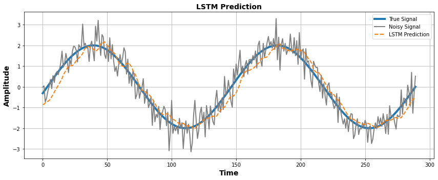

# LSTM for Signal Prediction — Time Series Forecasting Demo

This repository demonstrates how to use an **LSTM (Long Short-Term Memory)** neural network to predict future values of a **noisy sine wave** using its past samples.  
It serves as an educational example for time-series prediction using deep learning.
---

## Overview

- **Task**: Predict the next value in a noisy signal given past values  
- **Model**: Single-layer LSTM + Dense  
- **Input**: Sequence of past `window_size` samples  
- **Output**: Next sample value  
- **Loss**: Mean Squared Error (MSE)
---

## What is LSTM?

LSTM is a type of Recurrent Neural Network (RNN) designed to learn long-term dependencies in sequential data.  
It solves the **vanishing gradient problem** by introducing memory cells and gating mechanisms.

Each LSTM cell has the following components:
---

### LSTM Equations

1. **Forget Gate**  
   \( f_t = \sigma(W_f \cdot [h_{t-1}, x_t] + b_f) \)

2. **Input Gate**  
   \( i_t = \sigma(W_i \cdot [h_{t-1}, x_t] + b_i) \)

3. **Candidate Cell State**  
   \( \tilde{c}_t = \tanh(W_c \cdot [h_{t-1}, x_t] + b_c) \)

4. **Update Cell State**  
   \( c_t = f_t \cdot c_{t-1} + i_t \cdot \tilde{c}_t \)

5. **Output Gate**  
   \( o_t = \sigma(W_o \cdot [h_{t-1}, x_t] + b_o) \)

6. **Final Hidden Output**  
   \( h_t = o_t \cdot \tanh(c_t) \)\
---

## Signal Generation

- The target signal is a sine wave with added Gaussian noise:
- true_signal = 2 * np.sin(t)
- noise = np.random.normal(0, 0.5, size=n)
- noisy_signal = true_signal + noise

---

## Model Architecture

- model = Sequential()
- model.add(LSTM(32, input_shape=(window_size, 1))
- model.add(Dense(1))
- model.compile(optimizer='adam', loss='mse')

---

## Results

We use Mean Squared Error to quantify prediction performance:

- from sklearn.metrics import mean_squared_error
- mse = mean_squared_error(y_true, y_pred)
- A lower MSE indicates better prediction accuracy.
---

## Author

Sahar Jahani

🔗 GitHub Profile
---

## Next Steps

- Add recursive prediction
- Use real-world signals (temperature, stock, biomedical, etc)
- Compare LSTM with ARIMA, GRU, Transformer
